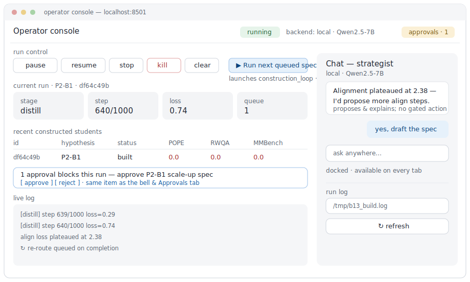

# Multi-Agent System for VLM Optimization

[](https://github.com/hanwook-cho/multi-agent-vlm-optimization-system/actions/workflows/verify-schemas.yml)
[](LICENSE)
[](pyproject.toml)

An autonomous multi-agent system whose **goal** is to compress the time required to produce a competitive edge vision-language model — from the team-months of focused expert work behind models like LFM2-VL-450M, SmolVLM-500M, and MiniCPM-V toward solo-developer-months, using the system itself as the optimization tool.

**The system is the deliverable; the compressed time-to-result is the central claim; a competitive model is the proof-of-work.**

> **Honest status (Phase 2, in progress):** the system is built and running — a closed agent loop that proposes, builds/distills, evaluates on-device-path, and re-routes. The headline *proof-of-work model is not yet achieved*: the construction loop works end-to-end but the latest constructed student is still under-trained. The interesting results so far are as much about what *didn't* work — see [`docs/observations/`](docs/observations/) for the documented negative results and how the system corrected course.

## Status

**Phase 2 in progress.** The Mode A loop is closed and the system now *constructs* models, not just configures them: the Search Strategist proposes a config experiment or a student-construction spec, deterministic services build/distill/evaluate it on a held-constant path, results land in the experiment ledger, and the agent re-routes (ADR-0011/0012). An operator console (below) gives a live UI to run, watch, steer, and gate it.

See [`STATUS.md`](STATUS.md) for the detailed state and [`docs/VLM_Optimization_HLD.md`](docs/VLM_Optimization_HLD.md) §6 (Figure 1) for the architecture.

## What this is

The system, given a vision-language task and a target edge device (primarily iPhone 16 Pro / Apple Silicon; Raspberry Pi 5 was scoped but deferred), autonomously produces a deployable inference pipeline measured against real on-device latency, memory, and accuracy. It starts from well-known optimization techniques (Mode A) and can escalate to research-driven exploration (Mode B) when known techniques are exhausted. Humans gate consequential decisions (architecture changes, eval-metric changes, mode escalation, device deploys) — see [`docs/VLM_Optimization_HLD.md`](docs/VLM_Optimization_HLD.md) §5.

## Operator console

A live browser UI (ADR-0013) to run, watch, steer, and gate the system: pause/stop/kill controls, current-run status and live logs, recent constructed-student scores, a docked chat with the Search Strategist (local by default), and an approvals queue for gated decisions.



```bash
streamlit run operator_console.py     # → http://localhost:8501
```

## Development environment

The system is developed and the reported results are produced on a single, fixed
reference setup. The on-device numbers (latency/memory) are only meaningful
against this hardware — see `docs/observations/` for the per-run context.

| | Reference setup (where results were produced) | Minimum |
|---|---|---|
| Machine | Apple **M4, 16 GB**, macOS 26 | Apple Silicon (for the MPS train/eval paths) |
| Python | **3.14** (daily driver) | **3.11+** — CI gates on 3.11 |
| Compute path | PyTorch **MPS** (`torch` 2.12, `transformers` 5.9, `peft` 0.19) | `torch>=2.1`, `transformers>=4.40` |
| Local agent backend (default) | external **llama.cpp `llama-server`** + Qwen2.5-7B-Instruct (Q4_K_M) on `:8080`, via the `openai` client | any OpenAI-compatible endpoint (llama.cpp, Ollama) |
| API agent backend (opt-in) | `anthropic` client, `ANTHROPIC_API_KEY` env, `STRATEGIST_BACKEND=api` | — |

> **16 GB constraint:** fp32 VLM fine-tuning must run at **batch-size 1** on this
> machine or it swap-thrashes. The dependency lower bounds are *floors*, not the
> validated versions; the table's left column is what the results were run on.

**Default local backend needs an external server.** Install llama.cpp separately
and launch it before using the agent/console chat:

```bash
llama-server -m qwen2.5-7b-instruct-q4_k_m.gguf --jinja --port 8080 -c 8192
```

## How to

```bash
# 1. install — pick the extras you need (see pyproject.toml)
python -m pip install -e ".[dev]"                       # tests / schemas only (no heavy deps)
python -m pip install -e ".[all]"                       # train + eval + console + agent backends
#    or, for the test/dev pin set used by CI:
python -m pip install -r requirements-dev.txt

# 2. run the test suite (deterministic logic; no model downloads)
python -m pytest -q

# 3. launch the operator console
streamlit run operator_console.py                       # → http://localhost:8501

# 4. read-only metrics dashboard (Phase 0/2 baselines, Pareto)
streamlit run dashboard.py
```

### Operator controls (also available from the CLI)

```bash
# pause / resume / stop (graceful) / kill (abort) a long run; loops react at the next checkpoint
python -m services.run_control status
python -m services.run_control pause "lunch"
python -m services.run_control resume
python -m services.run_control kill  "swap-thrashing"

# approvals queue (gated decisions): list / request / approve / reject
python -m services.approvals list
python -m services.approvals approve <id>
```

### Run a system-driven construction (Phase 2, compute-gated)

The Search Strategist proposes a `StudentSpec`; the construction loop assembles a student (LM + vision encoder + projector), distills it from the Qwen2.5-VL-3B teacher, and scores it same-path. See [`docs/decisions/0012-system-driven-student-construction.md`](docs/decisions/0012-system-driven-student-construction.md).

```bash
# the construction loop consumes the agent's queued spec, builds, evaluates, records to the ledger
python services/construction_loop.py --eval --align-steps 200 --distill-steps 1000

# the generic builder directly (with a spec), for one-off runs
python runners/build_student.py --spec tests/fixtures/student_spec_p2b1_qwen05b_siglip.json --smoke
```

Runs tee their output to `artifacts/logs/`, and the operator console auto-points at the newest one (with an optional auto-refresh) — so progress shows up on the Monitor tab without wiring a log path.

`run.yaml` (see [`configs/run.example.yaml`](configs/run.example.yaml)) declares the authorized goal, success criteria, eval set, allowed hypotheses, and the agent/chat backend (`local` by default, `api` opt-in).

## Documentation

- **The story:** read it as a **[blog post](https://hanwook-cho.github.io/multi-agent-vlm-optimization-system/writeup/)** (public, narrative) or the in-repo **[`docs/PHASE2_WRITEUP.md`](docs/PHASE2_WRITEUP.md)** (consolidated Phase-2 narrative). The system, the distribution-matching finding, the honest negatives, and the edge-viable student. **Start here.**
- **New to model optimization?** Visual study guides (diagrams + references) on the techniques behind this system:
  - **[Model Optimization primer](https://hanwook-cho.github.io/multi-agent-vlm-optimization-system/guide/)** — distillation, NAS, pruning, quantization, LoRA, weight sharing, early exit. ([source](docs/guide/index.html))
  - **[KV Cache Optimization primer](https://hanwook-cho.github.io/multi-agent-vlm-optimization-system/guide-kv-cache/)** — MQA/GQA/MLA, KV quantization (KIVI, QJL, TurboQuant), token eviction, PagedAttention. ([source](docs/guide-kv-cache/index.html))
- [`docs/VLM_Optimization_Goals.md`](docs/VLM_Optimization_Goals.md) — ultimate goal, success criteria, phase structure, conduct rules.
- [`docs/VLM_Optimization_HLD.md`](docs/VLM_Optimization_HLD.md) — architecture (agents + services, Mode A / Mode B); §6 Figure 1 is the system diagram; §6.5 Amendment A is system-driven construction.
- [`docs/VLM_Optimization_PriorArt.md`](docs/VLM_Optimization_PriorArt.md) — position relative to AutoML/NAS, LLM-driven AutoML, AI-Scientist, and production edge inference.
- [`docs/decisions/`](docs/decisions/) — ADRs (e.g. 0011 Phase-2 strategy correction, 0012 system-driven construction, 0013 operator console).
- [`docs/observations/`](docs/observations/) — dated experiment results, including negative results.

## What this is not

- Not a generic AutoML tool — VLM-specific, edge-specific.
- Not "fully autonomous research" — humans gate consequential decisions (see HLD §5).
- Not a competitor to Liquid AI or Apple on individual model quality — the contribution is the *method* that compresses optimization time, demonstrated by producing one competitive model in solo-months rather than team-months. See `docs/VLM_Optimization_PriorArt.md`.
- **Not externally-validated benchmarking.** Every score reported here and in `STATUS.md` / `docs/observations/` is **internal-only**: 100-sample slices on a non-official protocol, floor-adjusted, with no published number reproduced yet. They are trusted for *steering experiments on a held-constant path* — **not for external citation or model-to-model leaderboard claims**. A full-set, official-protocol validation run is deferred (decision 2026-06-16).

## License

Apache 2.0 (see [`LICENSE`](LICENSE)) — applies to this project's source code only. The third-party models, datasets, and benchmarks the system *uses* (and does not redistribute) remain under their own licenses; see [`docs/THIRD_PARTY.md`](docs/THIRD_PARTY.md).
